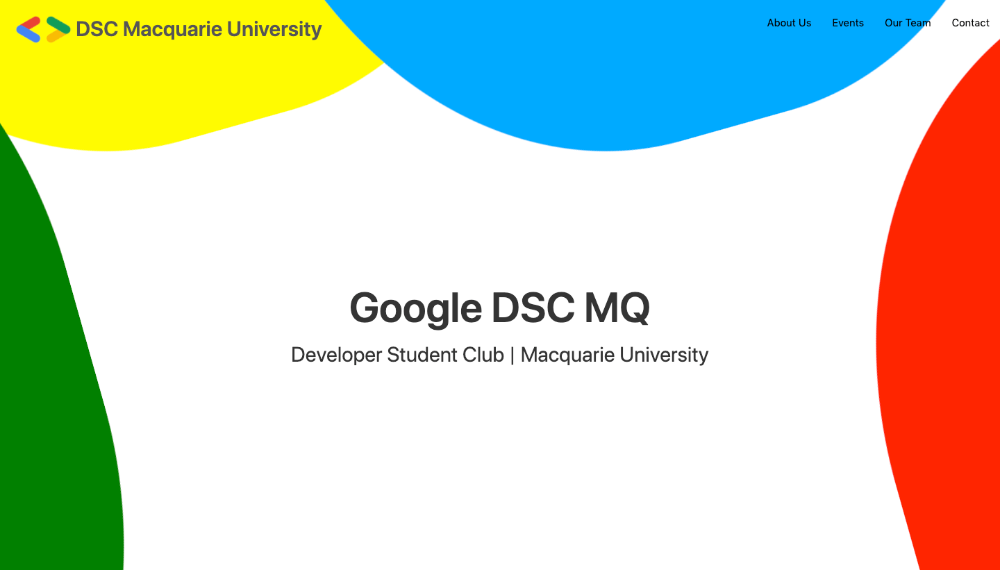

# Macquarie University Developer Student Clubs Website

👋 Welcome to our github repo

This application is currently deployed using Python/Flask/Gunicorn to heroku.

[Website Link](https://dscmqwebsite.herokuapp.com/)

Flask is a lightweight web framework that allows us to build simple applications quickly.

Gunicorn - aka Green Unicorn is a lightweight http server which is simple to use and compatible with a wide variety of software. It differs from a web server such as apache of nginx in that Gunicorn is an _application server_

Lastly Python is our chosen language for its ease of use.

## How to set up a development environment

 _Clone this repo to wherever you like to keep your files_

 Ensure you have Python > 3.7 installed correctly on your machine -  [Guide](https://www.tutorialspoint.com/python/python_environment.htm)

 Open up your terminal and `cd` _Linux/Mac_ or `chdir` _Windows_ to cloned repository folder on your computer

**Install** _Python Virtual Environment "pip"_ package using python package manager

### Setting up a virtual python environment

`pip install virtualenv`

**Create** a virtual environment for our project, this will keep all of the packages we use for this project seperate from other projects. We need venv for this reason - if two or more projects need two or more different versions of a package to run it could cause issues for you if you kept all python packages/dependencies in the same folder on your system.

`virtualenv dscmqwebsite`

**Activate** your virtual environment, once activated the commands you issue, i.e installing packages will end up in their own special folder made just for this project.

_Mac/linux_

`source mypython/bin/activate`

_Windows users_

`mypthon\Scripts\activate`

*Note*

When you are finished working on the project, you can type `deactivate` to exit the virtual environment

### Installing required packages

_Activate your python venv first so we don't install packages in the system python path or whatever else you have configured_

We are using a requirements.txt file, which is a list of packages and version numbers

It was generated using the format freeze flag to remove the /tmp/ stuff and get just the version numbers required for packages `pip3 list --format=freeze > requirements.txt` _dont run this_

To install the dependencies required for this project run the following command

`pip install -r requirements.txt`

### Running the flask application - i.e getting the site running in your browser

`cd` or `chdir` to the **root** folder in the root folder of the project i.e "\<path-to-where-you-put-it\>/DSCMQWebsite"

We need to set some environment variables for our flask session. We could add them to our terminal configuration later _make sure to remember if you open a new terminal you will need to set them again for now_

_Mac/Linux Users_

`export FLASK_APP=wsgi.py ` - tells flask which the file name of our python app, note it will run fine without this command usually as flask will look for a file named app.py or wsgi.py of which we have the latter

`export FLASK_ENV=development ` - runs a development version of the server with debugging enabled

_Windows Users_

`set FLASK_APP=wsgi.py `

`set FLASK_ENV=development `

**Run the flask app**

`flask run`

Success 😀 You should now see a prompt in your terminal with an IP address or URL where you can access the DSCMQ Website running locally on your computer

### Recomended Editor

I recommend VS Code, in part because you can run `code .` after you clone the repository in your terminal and then it will launch VS Code and you can finish the rest of the setup - its a nice workflow

### Troubleshooting

_Error: Could not import "wsgi"._

1. Make sure you are in the root folder in your terminal before running `flask run`
2. Check that your virtual environment is activated and that the dependencies were installed correctly in your virtual environment /bin folder - you can find the folder on your system and check for yourself

